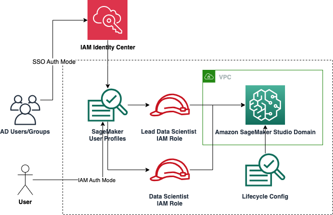

# SageMaker Studio Infrastructure

This module contains the resources that are required to deploy the SageMaker Studio infrastructure. It defines the setup for Amazon SageMaker Studio Domain and creates SageMaker Studio User Profiles for Data Scientists and Lead Data Scientists.

**NOTE** To effectively use this repository you would need to have a good understanding around AWS networking services, AWS CloudFormation and AWS CDK.
- [SageMaker studio Infrastructure](#sagemaker-studio-infrastructure)
    - [SageMaker Studio Stack](#sagemaker-studio-stack)
  - [Inputs and outputs:](#inputs-and-outputs)
    - [Required inputs:](#required-inputs)
    - [Optional Inputs:](#optional-inputs)
    - [Outputs (module metadata):](#outputs-module-metadata)
    - [Example Output:](#example-output)
  - [Getting Started](#getting-started)
    - [Prerequisites](#prerequisites)
    - [Module Structure](#module-structure)
  - [Troubleshooting](#troubleshooting)

### Architecture



This module handles the deployment of the following resources:

1. SageMaker Studio Domain requires, along with
2. IAM roles which would be linked to SM Studio user profiles. User Profile creating process is managed by manifests files in `manifests/shared-infra/mlops-modules.yaml`. You can simply add new entries in the list to create a new user. The user will be linked to a role depending on which group you add them to (`data_science_users` or `lead_data_science_users`).

```
  - name: data_science_users
    value:
    - data-scientist
  - name: lead_data_science_users
    value:
    - lead-data-scientist
```

3. Default SageMaker Project Templates are also enabled on the account on the targeted region using a custom resource; the custom resource uses a lambda function, `functions/sm_studio/enable_sm_projects`, to make necessary SDK calls to both Amazon Service Catalog and Amazon SageMaker.

## Inputs and outputs:
### Required inputs:
  - `vpc_id` - the VPC id that the SageMaker Studio Domain will be created in
  - `subnet_ids` - the subnets that the SageMaker Studio Domai will be created in
### Optional Inputs:
  - `studio_domain_name` - name of the SageMaker Studio Domain
  - `studio_bucket_name` - name of the bucket used by studio
  - `app_image_config_name` - custom kernel app config name
  - `image_name` - custom kernel image name
  - `data_science_users` - a list of data science user names to create
  - `lead_data_science_users` - a list of lead data science user names to create
  - `retain_efs` - True | False -- if set to True, the EFS volume will persist after domain deletion.  Default is True
  - `enable_custom_sagemaker_projects` - True | False -- if set to True, custom sagemaker projects will be enabled for the data science and lead data science users.  Default is False

### Outputs (module metadata):
  - `StudioDomainName` - the name of the domain created by Sagemaker Studio
  - `StudioDomainId` - the Id of the domain created by Sagemaker Studio
  - `StudioBucketName` - the Bucket (or prefix) given access to Sagemaker Studio
  - `StudioDomainEFSId` - the EFS created by Sagemaker Studio
  - `DataScientistRoleArn` - ARN of the Data Scientist IAM role
  - `LeadDataScientistRoleArn` - ARN of the Lead Data Scientist IAM role
  - `SageMakerExecutionRoleArn` - ARN of the SageMaker execution IAM role

### Example Output:
```yaml
{
  "DataScientistRoleArn": "arn:aws:iam::XXXXXXXXXXXX:role/mlops-sagemaker-sage-smrolesdatascientistrole-DYPIVQ6NUSP9",
  "LeadDataScientistRoleArn": "arn:aws:iam::XXXXXXXXXXXX:role/mlops-sagemaker-sage-smrolesleaddatascientist-V1YL0FQONH62",
  "SageMakerExecutionRoleArn": "arn:aws:iam::XXXXXXXXXXXX:role/mlops-sagemaker-sage-smrolessagemakerstudioro-F6HGOUX0JGTI",
  "StudioBucketName": "mlops-*",
  "StudioDomainEFSId": "fs-0a550ea71ecac4978",
  "StudioDomainId": "d-flfqmvy84hfq",
  "StudioDomainName": "mlops-sagemaker-sagemaker-sagemaker-studio-studio-domain"
}
```

## Getting Started

### Prerequisites

This is an AWS CDK project written in Python 3.8. Here's what you need to have on your workstation before you can deploy this project. It is preferred to use a linux OS to be able to run all cli commands and avoid path issues.

* [Node.js](https://nodejs.org/)
* [Python3.8](https://www.python.org/downloads/release/python-380/) or [Miniconda](https://docs.conda.io/en/latest/miniconda.html)
* [AWS CDK v2](https://aws.amazon.com/cdk/)
* [AWS CLI](https://aws.amazon.com/cli/)
* [Docker](https://docs.docker.com/desktop/)

### Module Structure

```
├── functions                                   <--- lambda functions and layers
│   └── sm_studio                               <--- sagemaker studio stack related lambda function
│       └── enable_sm_projects                  <--- lambda function to enable sagemaker projects on the account and links the IAM roles of the domain users (used as a custom resource)
├── helper constructs                           <--- helper CDK constructs
│   └── sm_roles.py                             <--- helper construct containing IAM roles for sagemaker studio users
├── scripts                                     <--- helper scripts
│   └── check_lcc_state.sh                      <--- script to check if sagemaker studio lifecycle config needs an update
│   └── delete-domains.py                       <--- python helper script to delete sagemaker domains
│   └── delete_efs.py                           <--- python helper script to delete efs mounts
│   └── on-jupyter-server-start.sh              <--- script that installs the idle notebook auto-checker jupyter server extension
├── tests                                       <--- module unit tests
├── app.py                                      <--- cdk application entrypoint
├── coverage.ini                                <--- test coverage tool parameters file
├── deployspec.yaml                             <--- file that defines deployment instructions
├── modulestack.yaml                            <--- cloudformation stack that contains permissions needed to deploy the module
├── pyproject.toml                              <--- build system requirements and settings file
├── README.md                                   <--- module documentation markdown file
├── requirements.txt                            <--- cdk packages used in the stacks (must be installed)
├── stack.py                                    <--- stack to create sagemaker studio domain along with related IAM roles and the domain users
├── update-domain-input.template.json           <--- json template to update sagemaker domain lifecycle configs
```
## Troubleshooting


* **Resource being used by another resource**

This error is harder to track and would require some effort to trace where is the resource that we want to delete is being used and severe that dependency before running the destroy command again.

**NOTE** You should just really follow CloudFormation error messages and debug from there as they would include details about which resource is causing the error and in some occasion information into what needs to happen in order to resolve it.


* **CDK version X instead of Y**

This error relates to a new update to cdk so run `npm install -g aws-cdk` again to update your cdk to the latest version and then run the deployment step again for each account that your stacks are deployed.

* **`cdk synth`** **not running**

One of the following would solve the problem:

    * Docker is having an issue so restart your docker daemon
    * Refresh your awscli credentials
